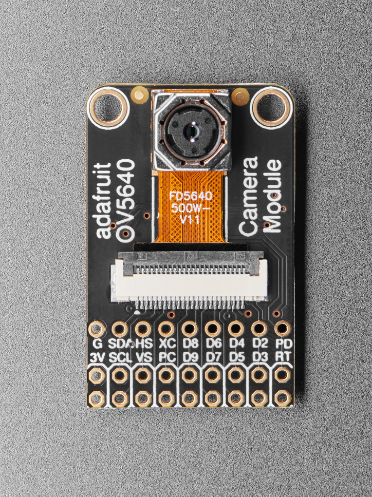

Camera
======

The camera component uses the `esp32-camera <https://github.com/espressif/esp32-camera>`_ driver to capture images using the `Adafruit OV5640 Camera Board <https://www.adafruit.com/product/5840>`_.

        The `OV5640 <https://www.adafruit.com/product/5840>`_ camera board

The camera pins are connected to the ESP32-S3 as follows:

=============== ==============
Camera          ESP32-S3
=============== ==============
SDA             GPIO 4
SCL             GPIO 5
VSYNC           GPIO 18
HSYNC           GPIO 8
PCLK            GPIO 17
XCLK            GPIO 9
D2              GPIO 13
D3              GPIO 6
D4              GPIO 12
D5              GPIO 7
D6              GPIO 11
D7              GPIO 15
D8              GPIO 10
D9              GPIO 16
PWDN            GPIO 14
RESET           GPIO 42

=============== ==============

The camera in ``QR Reader mode`` takes 640x480 **Grayscale** images.
In the ``Camera mode`` it takes 2560x1600 images. The image format is read from the ``static config``, it is either **Grayscale** or **JPEG**. With **JPEG** images the image size must be reduced from 2560x1600!

When the device enters deep sleep mode, the camera pins are isolated to prevent leakage current.

.. include-build-file:: inc/camera.inc