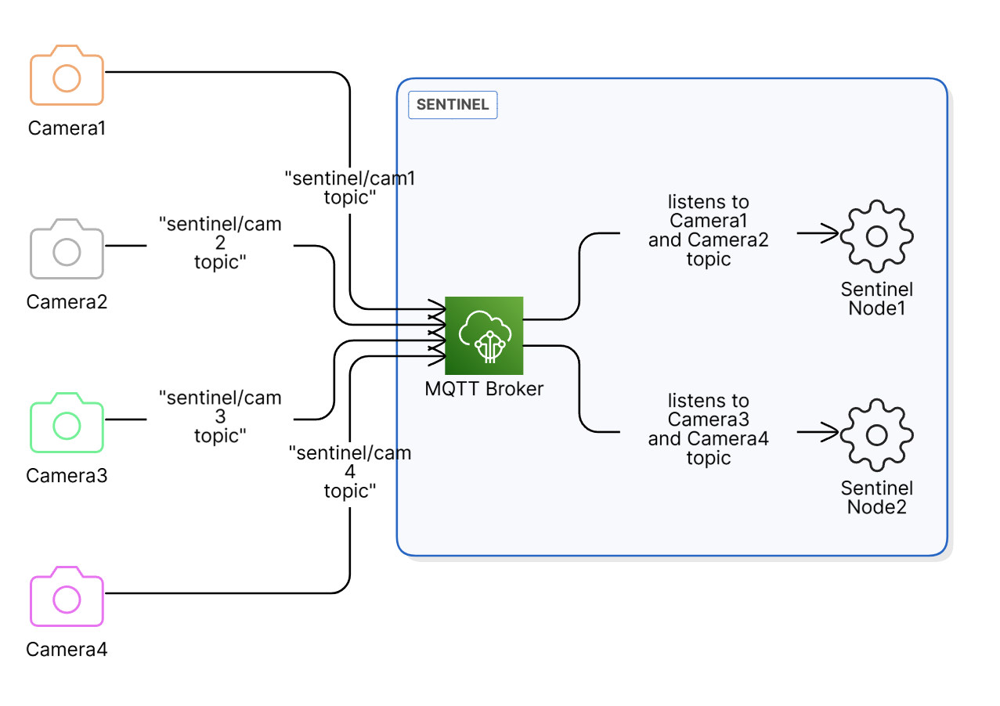

MQTT
======
The camera device communicates with the **Sentinel system** using this MQTT component.

        MQTT communication with the **Sentinel system**

The communication topics are:

- ``imageTopic``: MQTT topic for image transmission
- ``imageAckTopic``: MQTT topic for image header acknowledgment
- ``healthReportTopic``: MQTT topic for sending the sensor data
- ``healthReportRespTopic``: MQTT topic for receiving the ``dynamic config`` acknowledgment
- ``logTopic``: MQTT topic for logging

.. note::
    This component requires an active **WiFi** connection.

.. include-build-file:: inc/mqtt.inc