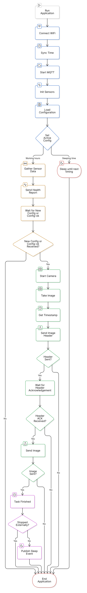
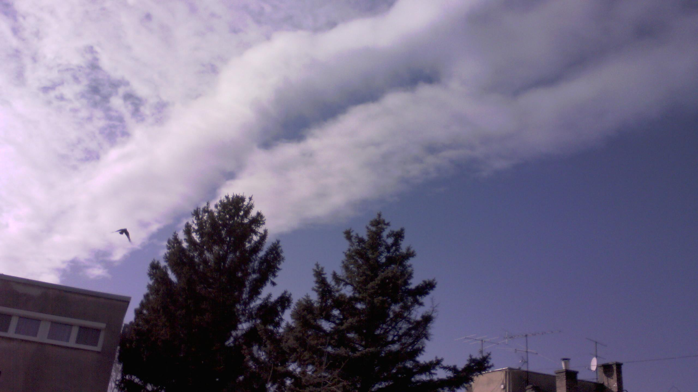

Camera App
===========
The ``Camera App`` is responsible for running the image capturing application on the ESP32-S3 device. It handles:

- Initializing all necessary components (WiFi, MQTT, sensors, camera)

- Managing configuration updates

- Capturing and sending images to an MQTT broker

- Health reporting

Components
-----------

- **Camera**: Handles image capture, also manages the camera hardware initialization and image buffer storage.

- **WiFi**: Manages network connection and time synchronization. Handles connection establishment, maintenance, and automatic reconnection logic.

- **MQTT**: Facilitates communication with the MQTT broker for health reports, images, and configuration updates. Implements topic management and message acknowledgment.

- **Config**:  Stores and manages the ``dynamic configuration``, handles it's loading, validation and update.

- **Sensors**:  Interfaces with sensors to collect data like battery temperature and charge. Formats sensor readings for inclusion in health reports.

Flowchart
----------

The following flowchart represents the main logic of the application:

        Flowchart depicting the ``Camera App``

Health Report 
--------------

The health report JSON contains these key-value pairs:

.. code-block:: json

{
    "timestamp": "2025-02-26T10:05:11Z",
    "configId": "8D8AC610-566D-4EF0-9C22-186B2A5ED793",
    "period": 40,
    "batteryCharge": 90,
    "batteryTemp": 25,
    "cpuTemp": 30,
    "luminosity": 3000,
    "chargeCurrent": 400
}

Image Header 
-------------

The image header is sent before the image, the JSON is structured like:

.. code-block:: json
{
    "timestamp": "2025-02-24T13:07:06Z",
    "size": 4096000,
    "mode": "GRAY"
}

Image
------

The image format is given in the ``static configuration``, if the ``cameraMode`` is set to **GRAY** the image will be **1BPP/GRAYSCALE** format.

An example image is:

        **GRAYSCALE** image

When the ``cameraMode`` is set to **COLOR** the image is **JPEG** encoded.

An example image is:

        **JPEG** image

External Dependencies
----------------------

- `ArduinoJson <https://github.com/bblanchon/ArduinoJson>`_

- `esp32-camera <https://github.com/espressif/esp32-camera>`_

.. include-build-file:: inc/camera_app.inc