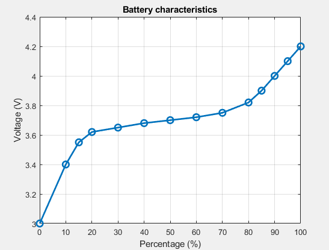

Battery Charge Sensor
======================
This class converts the raw battery voltage reading from the BQ25622 into a percentage value. This percentage will then be sent in the health report JSON.

The characteristics of the Samsung INR21700-53G battery:

    The Voltage vs Battery percentage characteristics

.. include-build-file:: inc/battery_charge.inc