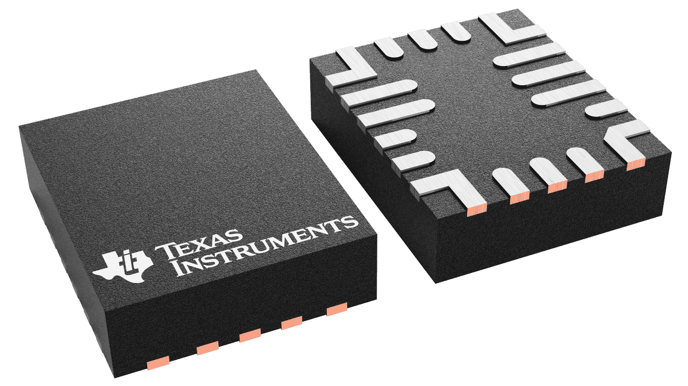
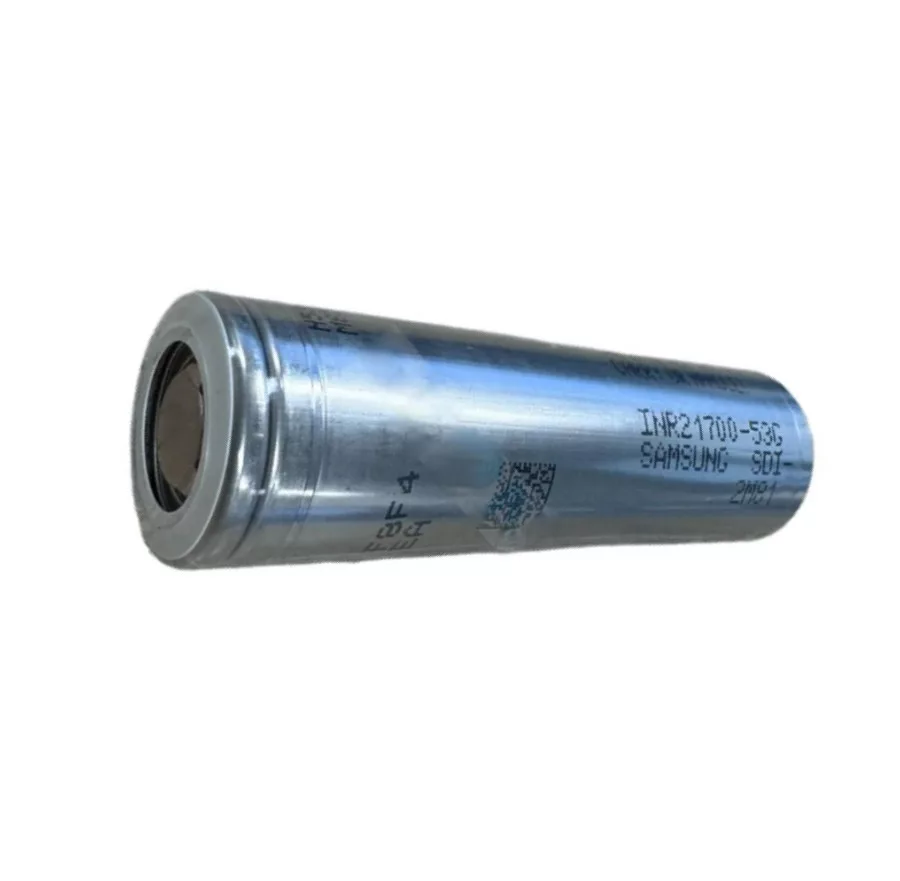
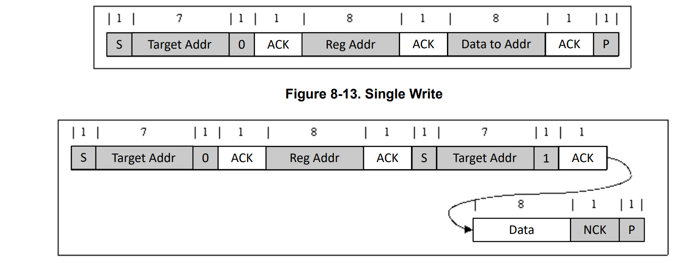

Battery Manager 
=================
The ``BatteryManager`` class provides an interface for controlling and monitoring the `BQ25622 <https://www.ti.com/product/BQ25622>`_ battery charging IC.
It utilizes I2C communication to read battery voltage, temperature, and battery current parameters. These parameters are then forwarded to the corresponding sensor classes for further processing.

        The BQ25622 battery charger IC

The BQ25622 manages the charging process autonomously, thus requiring no intervention from the ESP32-S3, when it is in deep sleep mode.

Battery
--------

The battery used to power the system is a `Samsung INR21700-53G <https://thebatteryshop.eu/hu/Samsung-INR21700-53G-Li-Ion-akkumulator-cella?srsltid=AfmBOor2efUYfIvtGgnrTgcHRJNBeFCJHUbnHE9f6jeoKRS1kgvuOMz9>`_ 
lithium-ion cell with a nominal voltage of 3.6V and a capacity of 5300mAh.

        The Samsung INR21700-53G lithium-ion cell

I2C Communication
------------------

The driver implements the BQ25622's custom I2C communication protocol:

        The read and write I2C communication protocol

Constants
---------

The following constants are used for configuring and managing the BQ25622:

**I2C Address**

- ``BQ25622_ADDR = 0x6B`` — I2C address of the BQ25622.

**Register Map**

- ``REG_ADC_CONTROL = 0x26`` — Controls ADC operation.
- ``REG_VBAT_READ = 0x30`` — Contains battery voltage reading.
- ``REG_TEMP_READ = 0x34`` — Contains temperature sensor reading.
- ``REG_CHARGE_CURRENT = 0x2A`` — Contains charge current reading.

**ADC Configuration Bits**

- ``ADC_ENABLE = 0x80`` — Enables the ADC.
- ``ADC_AVG = 0x08`` — Enables ADC averaging.
- ``ADC_AVG_INIT = 0x04`` — Initializes ADC averaging.
- ``ADC_SAMPLE = 0xDF`` — Sets 11-bit effective resolution.
- ``ADC_RATE = 0x40`` — Enables one-shot mode.

.. include-build-file:: inc/battery_manager.inc