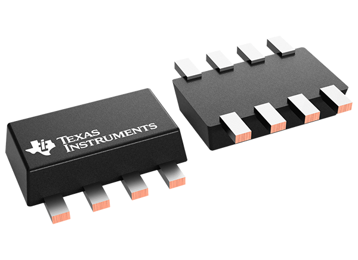
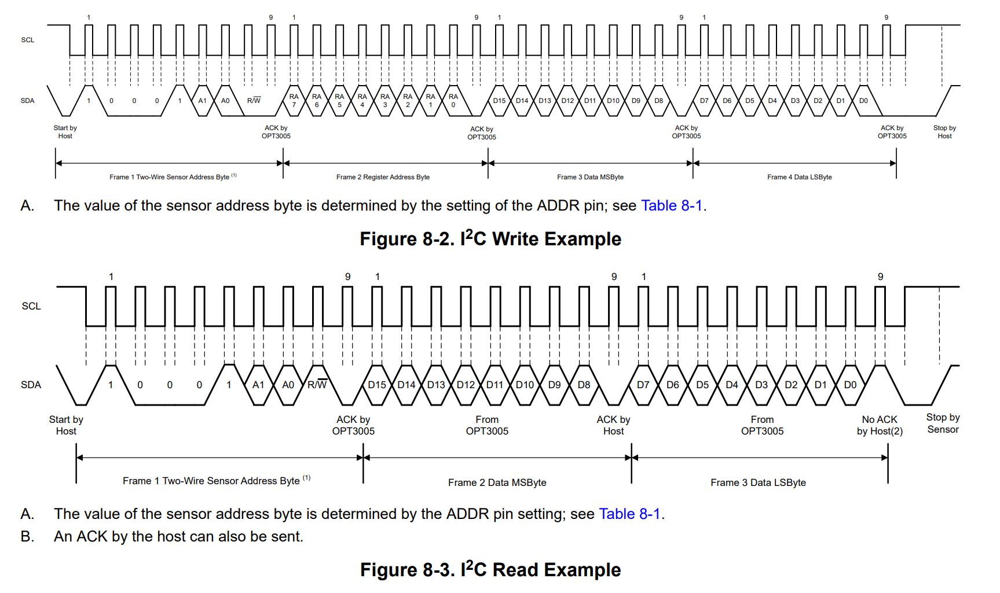

Light Level Sensor
===================

The `LightSensor` class provides an interface for interacting with the `Texas Instruments OPT3005 <https://www.ti.com/product/OPT3005>`_ ambient light sensor via I2C.

        The OPT3005 ambient light sensor

This sensor measures ambient light levels in lux. It implements the `ISensor` interface, allowing it to be used polymorphically.

I2C Communication
------------------
The driver implements the OPT3005's custom I2C communication protocol:

        The read and write I2C communication protocol

Constants
---------

- ``OPT3005_ADDRESS``: I2C address of the OPT3005 sensor (0x45).

- ``OPT3005_RESULT_REG``: Register address for sensor result (0x00).

- ``OPT3005_CONFIG_REG``: Register address for sensor configuration (0x01).

- ``OPT3005_CONFIG_RANGE_AUTO``: Enables automatic range detection.

- ``OPT3005_CONFIG_CONV_TIME_100MS``: Sets conversion time to 100 ms.

- ``OPT3005_CONFIG_SINGLE_SHOT``: Configures the sensor to take one measurement per trigger.

- ``OPT3005_CONFIG_OVF``: Overflow bit mask.

- ``OPT3005_CONFIG_CONV_READY``: Data-ready status bit.

.. include-build-file:: inc/light_sensor.inc